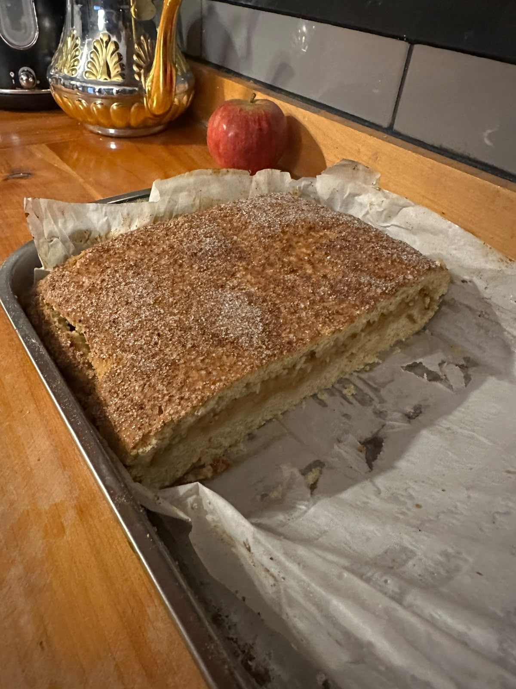
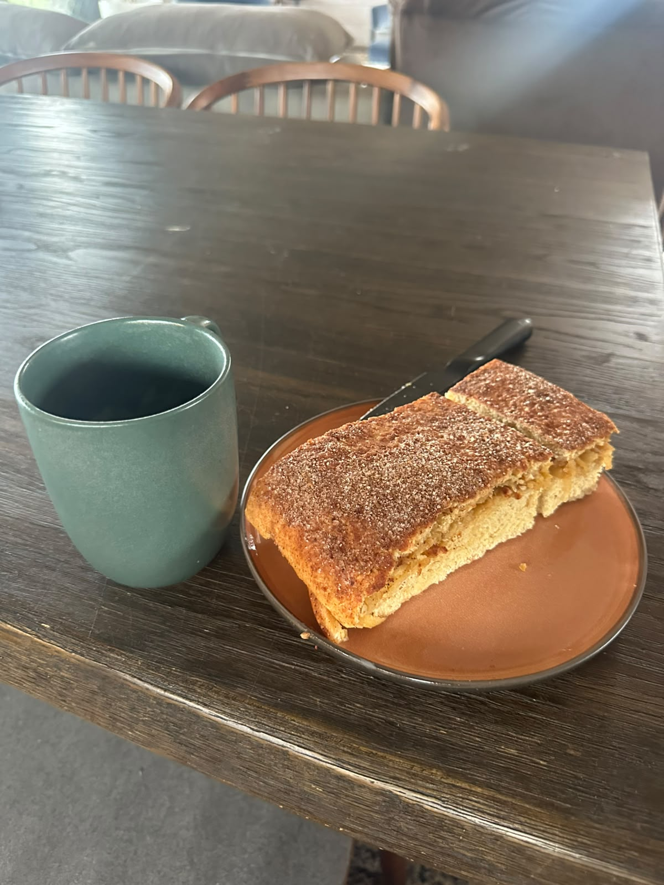

🌍 [🇺🇦 Українська](uk.md) · **🇬🇧 English** · [🇪🇸 Español](es.md) · [🇵🇹 Português](pt.md) · [🏠 Home](README.md)

# 🥧 Mom's Vinnytsia Pie

*A family apple–cheese pie from Vinnytsia, Ukraine.* Soft farmer's-cheese dough, a layer of grated apples, and a glossy golden crust brushed with strong black tea. This is my mom's recipe, written down word for word so it never gets lost.

> 💛 **Mom's rule:** don't double the batch. Too much dough is hard to work with.

  
   
  <em>🧪 Trial run number one — out of the oven at 23:44, 25 July 2026, cooked with <strong>Chef Allene</strong>.</em>

---

## 🧾 Ingredients

### For the dough
| | Ingredient | Amount |
|---|---|---|
| 🧀 | Farmer's cheese / quark (*tvorog*), well-drained | **500 g** |
| 🌾 | Flour | **1 kg** (Mom's 4 cups, counted at ~250 g each) |
| 🥚 | Eggs | **5** |
| 🍬 | Sugar | **1–1.5 cups** (recipe says 1.5; use 1 or less for a lighter pie) |
| 🧈 | Oil (sunflower / vegetable) | **2 tbsp** (added at the very end) |
| 🧂 | Salt | **1 tsp** |
| 🌿 | Vanilla | **1 tsp** liquid **or** 1 packet vanilla sugar |
| 🥄 | Baking soda | **1 tsp** — *only if your flour has no leavening* |

> 🌾 **About the flour:** Mom measures in cups and counts each one as ~250 g, so her "4 cups" is the **1 kg** on the scale — go by the weight. Watch the dough too: it should come together soft and only *slightly* sticky. If your flour already contains baking powder (self-rising), **skip the soda.**

> 🧀 **About the cheese — this is a *cheese dough*.** The cheese isn't a filling; it's ~~rubbed into the flour~~ **mixed into the dough** to build the dough itself, which is what makes this pie so tender. (See **Chef Allene's correction** at step 2 — she was right, and the wording has been fixed everywhere.) The original uses **tvorog** (Ukrainian *сир*) — a fresh, soft, mildly tangy curd cheese, the same family as German **Quark**. Don't have it? **Ricotta works great.** Full sourcing and substitutes (including where to find it in Chile 🇨🇱) are in the **🧀 The Cheese** section just below.

### For the filling
| | Ingredient | Amount |
|---|---|---|
| 🍏 | Apples (tart — Antonivka or Granny Smith), grated or thinly sliced | **4–5** |
| 🍬 | Sugar (or vanilla) to sprinkle over the apples | to taste |

### For the top
| | Ingredient | Amount |
|---|---|---|
| 🍵 | Strong brewed black tea (for brushing) | ~½ cup |
| 🍬 | Sugar to sprinkle on top | to taste |
| 🌿 | Ground cinnamon, mixed with the sugar for the top | to taste |

**🍳 You'll also need:** a baking tray (~30 × 40 cm), a rolling pin, a mixing bowl, a blender or hand mixer, a clean towel, a cotton pad or pastry brush, and a wooden toothpick.

---

## 🧀 The Cheese: What to Use & Where to Find It

**What it is.** *Tvorog* (Ukrainian *сир*, Russian *творог*) is a fresh curd cheese: soured milk gently warmed until it separates, then strained. It's soft, mild, and slightly tangy — not salty. Its western twin is **German Quark**. The finished dough should taste gently milky-tangy, never sharp.

**🇨🇱 Finding it in Chile.** There's no mass-market "Quark" on the shelves at Jumbo, Líder, Santa Isabel or Unimarc. Buy one of these instead:

- 🥇 **Ricotta** — the easiest swap, available everywhere. Look for **Ricotta Quillayes** (500 g tub or 1 kg bag); **Soprole**, **Colún**, and Jumbo's own **Cuisine & Co** also carry ricotta.
- 🧀 **Requesón / queso fresco batido / cottage** — **Quillayes**, **Colún**, **Soprole**, **Surlat**. This is the Latin-American cousin of *tvorog*; use it just like the real thing.
- 🇩🇪 **Actual labeled "Quark"** — **"Ricotta Quark" by Villa Baviera** is the closest, but you'll find it in German/southern specialty emporiums, not the big chains.

**Can I use ricotta? Yes.** Ricotta is a fresh cheese just like *tvorog*, so it works well — with two small tweaks:

1. **Drain it.** Ricotta is wetter. Let it sit in a sieve or cheesecloth for 30+ minutes and press out the extra whey, or the dough turns sticky.
2. **Add a little tang.** Ricotta is milder and slightly sweet. A squeeze of lemon juice, or a spoonful of sour cream or plain yogurt, brings back that gentle *tvorog* tang.

**🔁 More clever ways to do it without Quark:**

- **Strained yogurt — closest to real Quark.** Hang full-fat plain yogurt in cheesecloth overnight; the whey drips out and you're left with thick "yogurt cheese," basically homemade quark. Tangy and perfect.
- **Cottage cheese.** Blend it smooth first, then drain well.
- **Make your own in ~20 minutes.** Heat 1 L whole milk to about 85 °C (just below a boil), stir in 2–3 tbsp lemon juice or white vinegar (or a cup of kefir/buttermilk), wait until it curdles, then strain through cheesecloth. Rennet (*cuajo*, sold on MercadoLibre in Chile) does the same job.
- **Cream-cheese blend.** Philadelphia-style cream cheese loosened with a spoon of yogurt — richer and less traditional, but a great pinch-hitter.
- **Dry queso fresco / panela.** Grate or crumble a firm, dry fresh cheese; the drier ones behave a lot like farmer's cheese.

> ✅ Whatever you choose, aim for **~500 g of a soft, mild, well-drained fresh cheese** and you're golden.

---

## 👩‍🍳 Step by step

1. **🌾 Mix the dry base.** Combine the flour with the salt (and the 1 tsp soda *only* if your flour has no baking powder). Stir well.

2. **🧀 ~~Rub in the cheese.~~ Mix in the cheese.** Add the 500 g of cheese and ~~rub it into the flour~~ **mix it into the dough** with your hands until you get an even, crumbly mass.

   > 🧑‍🍳 **Chef Allene says that's incorrect.** On the trial run (25 July 2026) she stopped me mid-step: you don't ~~rub it into the flour~~ — you **mix it into the dough.** You can't rub anything *into* flour. Flour just sits there being flour. (And yes, "rubbing in" is a real pastry term — for cold *butter*. Wet curd cheese is not butter.) Mom's recipe, Allene's terminology, and the terminology wins.
   >
   > *Full disclosure: Chef Allene showed up for exactly one trial run, overruled a family recipe inside ten minutes with the calm of someone who has clearly done this before, and still had the pie out of the oven by 23:44. Consultant to this tutorial — permanently, if she'll take the job.* 💛

3. **🥚 Beat eggs and sugar.** In a separate bowl, beat the 5 eggs with the sugar until light and fluffy — a blender or mixer is perfect here. Add the vanilla and beat again.

4. **🥣 Bring it together.** Pour the egg mixture into the cheese-and-flour mixture and mix by hand into a dough. At the very end, add the 2 tablespoons of oil on top and work it in. The dough will be soft and a little sticky. If it sticks badly to your hands, dust in a little more flour — or just leave it.

5. **⏲️ Let it rest.** Cover the bowl with a towel and leave the dough for **30–40 minutes**.

6. **🍏 Prep the apples.** While the dough rests, grate or thinly slice the apples and sprinkle them with sugar (or vanilla). If they release a lot of juice, drain or squeeze it off — use the apples, not the juice.

7. **🔥 Heat the oven** to **180 °C (350 °F)**.

8. **✌️ Divide the dough.** Flour your work surface well. Turn out the rested dough and split it into two parts — **one larger, one smaller.**

9. **🫓 Roll the base.** Roll the larger piece to the size of your tray, dusting with flour so it doesn't stick. Roll it loosely onto the rolling pin (like a wrap) to move it, then unroll it onto the tray. Press and spread it with your fingers to cover the whole tray evenly — it's soft, so take your time.

10. **🍎 Add the apples.** Spread the drained apples evenly over the base.

11. **🎁 Cover it.** Roll out the smaller piece, lift it on the rolling pin, and lay it over the apples to cover completely. Tuck the edges under neatly, like an envelope, and even it out. If it tears, no problem — just press it back together.

12. **🍵 The tea glaze (the secret).** Brew strong black tea. Dip a cotton pad (or pastry brush) in it, wring it out so it's *damp, not dripping* — no puddles, or the pie won't bake through — and brush the whole top so the dough looks lightly wet. Mix a little ground cinnamon into some sugar and sprinkle it over the top.

13. **⏳ Bake.** **180 °C for 55 minutes**, until deep golden. Test with a wooden toothpick pushed into the dough — it should come out clean and dry. The pie will rise and turn a beautiful golden brown.

14. **🛌 Rest and serve.** Take it out, cover with a towel, and let it sit a few minutes. Slice, and enjoy. 💛

  
   
  <em>☕ The next morning, 08:42 — two slices and strong black tea. This is the correct way to eat it.</em>

---

## 💡 Tips

- 🧀 **Drier cheese is better.** If your *tvorog* is wet, drain it in cheesecloth first — a wet cheese makes a wet dough.
- 🍏 **Tart apples win.** They hold their shape and balance the sweetness. Antonivka is the classic; Granny Smith works anywhere.
- 🍵 **Why the tea?** Brushing with strong tea is Mom's trick for that deep golden top. An egg-yolk wash works too if you prefer.
- 🍬 **Go easy on sugar.** 1 cup (or less) is plenty if you don't have a sweet tooth.
- 🔪 **Cool before slicing** so it holds together. Dust with powdered sugar if you like.
- 📦 **Storing:** keep covered at room temperature for 1–2 days, or refrigerate.

---

## 💌 Mom's notes

- Don't make a double batch — a lot of dough is hard to work with.
- Vanilla: 1 teaspoon of the liquid kind, or 1 packet of vanilla sugar.
- **And send Mom a photo of the finished pie.** 📸 ✅ Done — trial run one, 25 July 2026, photographed and above.
- Terminology reviewed and corrected on site by **Chef Allene.** The dough gets *mixed*, thank you.

---

*🇺🇦 A recipe from Vinnytsia, written down with love so it lives on.*
